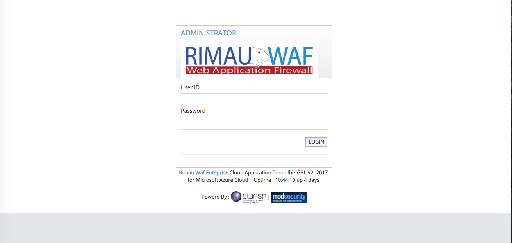
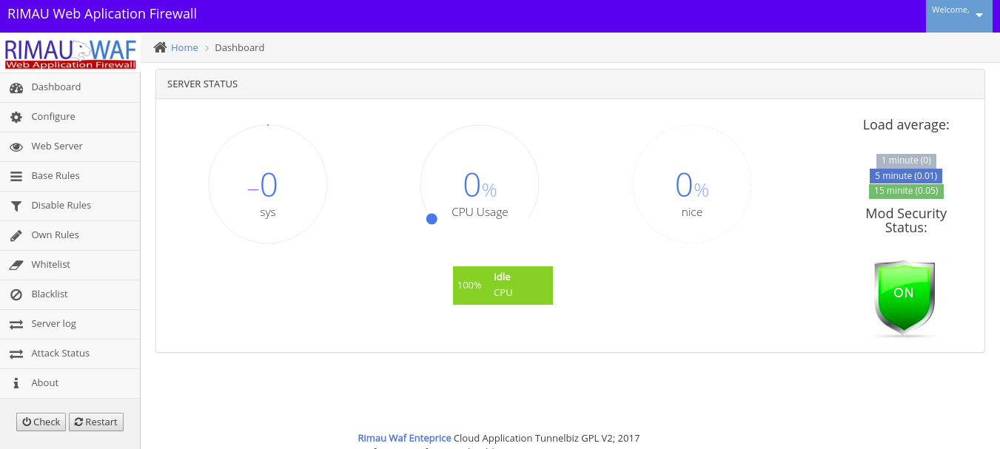

## Rimau Waf 1.0 Beta Version 

This project develops web user interface for WAF system using **ModSecurity** , apache and nginx 

## Code development
These systems have been developed using **codeigniter** and sqlite php framwork for the interfaces also use bootstrap
## Motivation

This project is developed for public waf web interface, the original source code has been changed to support the development of open source frameworks used in the development process. It is open source code to comply with the GPL V2

## Installation

currently only supports the installation of systems that use centos7. Pakage RPM can be uploaded to the installation process

**Manual Installation**

#yum install nginx
#yum install php php-fpm
#yum install sqlite
#yum install httpd
#yum install mod_security

git clone https://github.com/asklinux/rimau-waf.git

mv rimau-waf /usr/share/rimauwaf

cd /usr/share/rimauwaf

mv source web

echo 'Defaults:php-fpm !requiretty' >> /etc/sudoers

echo "User_Alias WWW_USER2 = php-fpm" >> /etc/sudoers

echo "Cmnd_Alias WWW_COMMANDS2 = /usr/bin/systemctl,/usr/bin/ln,/usr/bin/unlink,/usr/share/rimauwaf/run.sh,/usr/bin/tail,/usr/bin/sed,/usr/bin/cat,/usr/bin/grep,/usr/sbin/apachectl" >> /etc/sudoers

echo "WWW_USER2 localhost = (ALL) NOPASSWD:WWW_COMMANDS2" >> /etc/sudoers

semanage permissive -a httpd_t

vi /etc/nginx/nginx.conf

change port and folder to /usr/share/rimauwaf

#systemctl enable nginx

## Tests

Development of this system is still in beta development . There are a number of possible flaws in the operation, enhancements, partnerships are welcome

## Contributors

all builders are welcome to help 

core system by Hasnan

team public waf
Nawawi,Mani,Muiz,Anuar,Shaiful,Simon,Mazni,AB,Wira,Tajul,Amal 

## License

GNU GENERAL PUBLIC LICENSE

Version 2, June 1991

Copyright (C) 1989, 1991 Free Software Foundation, Inc.  
51 Franklin Street, Fifth Floor, Boston, MA  02110-1301, USA

Everyone is permitted to copy and distribute verbatim copies
of this license document, but changing it is not allowed.
